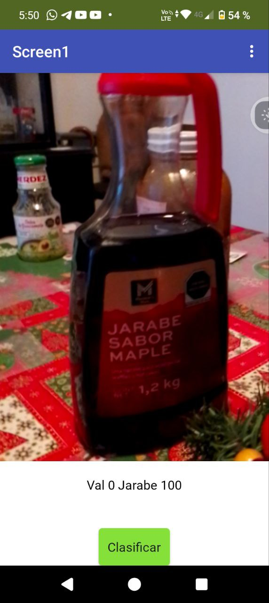

# Clasificador de Imágenes App

- Es una aplicación para dispositivos móviles hecha en MIT App Inventor que compara y clasifica dos objetos. 

Dentro de la aplicación, el usuario toma una fotografía de uno de los dos objetos a comparar y presiona el botón `clasificar`. En este caso se compara a la programadora de la aplicación "Val" con una botella de "Jarabe" de maple.

  

