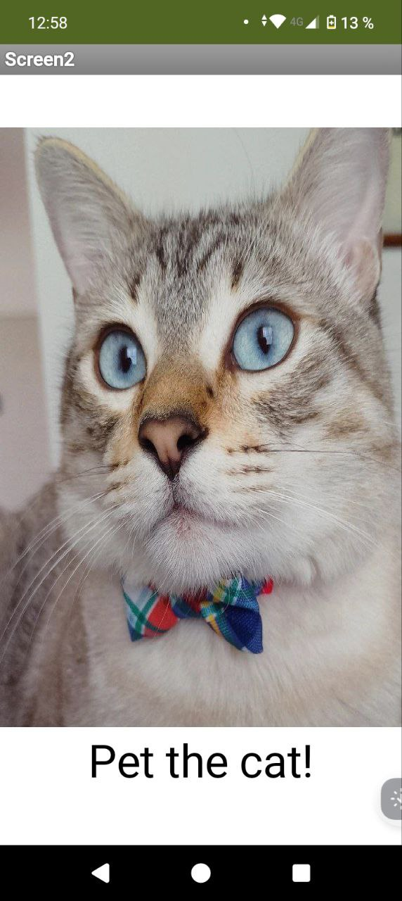

# Password Purr App

- Es una aplicación para dispositivos móviles hecha en MIT App Inventor que genera un sonido al presionar una imagen. 

En este caso genera un maullido al presionar la imagen de un gatito.

  

